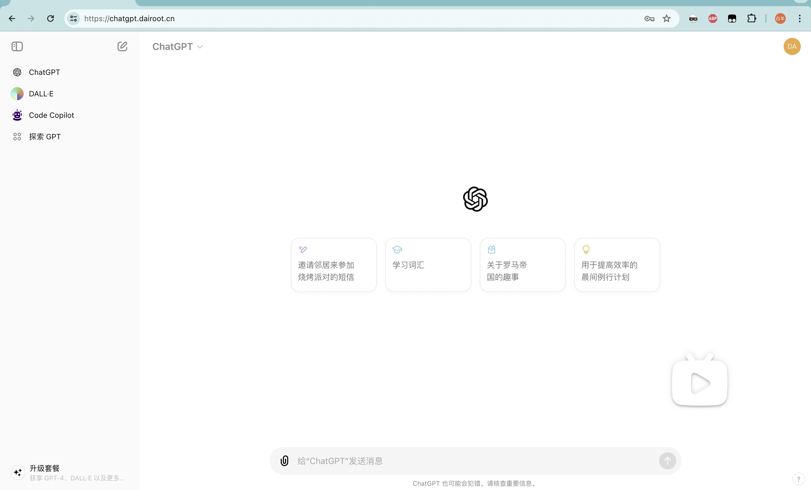

<h1 align="center">ChatGPT Mirror</h1>

[](https://hub.docker.com/r/dairoot/chatgpt-mirror)
[](https://github.com/dairoot/ChatGPT-Mirror/blob/main/LICENSE)

ChatGPT Mirror 后台是一个 ChatGPT 镜像站，允许多账号共享管理。实现多人同时使用 ChatGPT 服务。

## 特点

- 提供与官网同等的极致体验。
- 提供 ChatGPT 聊天接口 转 API `/v1/chat/completions` (开发中)
- 用户无需翻墙，便可轻松访问并使用 ChatGPT 官方网站的所有功能。
- 通过在 `Mirror` 后台录入 `ChatGPT Token`，让团队成员每人拥有独立账号 (或共享同一个`ChatGPT Plus`账号)。
- 提供便捷的管理后台，帮助管理员高效管理账号。

## 在线体验

https://chatgpt.dairoot.cn

## 部署

为了获得最佳体验，请先观看以下视频教程

https://github.com/user-attachments/assets/7b868672-cfaf-430c-9ec4-f1617a428225

<!--
<a href="https://www.bilibili.com/video/BV1fD421M7xP/" target="_blank">
  
</a>
-->

### 1. 部署

```bash
# 切换到 home 目录，并克隆 ChatGPT-Mirror 仓库
cd /home/ && git clone https://github.com/dairoot/ChatGPT-Mirror.git

cd ChatGPT-Mirror/ && git checkout

# 修改管理后台账号密码
cp .env.example .env && vi .env

# 启动
./deploy.sh

访问 http://localhost:50002
```

服务端部署，请点击查看[完整部署流程](./docs/deploy.md)

## 环境变量

| 字段             | 类型      | 默认值  | 必填 | 描述                                                                                                    |
| ---------------- | --------- | ------- | ---- | ------------------------------------------------------------------------------------------------------- |
| `ADMIN_USERNAME` | `string`  | `None`  | `是` | 管理后台账号                                                                                            |
| `ADMIN_PASSWORD` | `string`  | `None`  | `是` | 管理后台密码                                                                                            |
| `PROXY_URL_POOL` | `string`  | `None`  | `否` | 代理池链接，多个代理用逗号分隔<br>`http://username@password@ip:port,socks5://username@password@ip:port` |

## FQA

[简体中文 > 常见问题](./docs/faq-cn.md)

## 加入群聊

[Telegram](https://t.me/+34aYksZdq5ZhMzhl)

## 捐赠

[Buy Me a Coffee](./docs/donation.md)

## Star History


